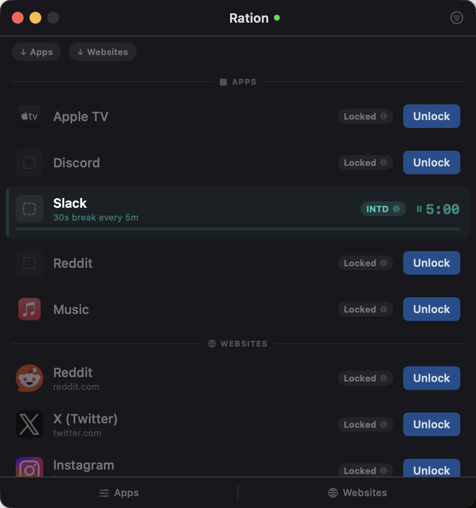
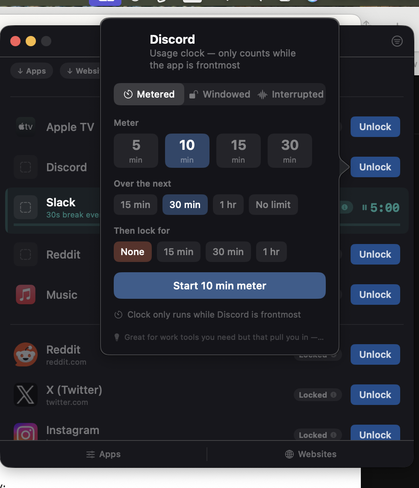

# Ration

**Your apps and websites, locked by default.**

Ration is a macOS app that locks your distracting apps and websites 24/7. When you want to use one, you choose how — a metered clock, a fixed window, or automatic interrupts. Then it enforces your choice.

> Built by [Save My Brain](https://savemybrain.co) — tiny apps for an overstimulated world.

---

## Screenshots

Apps and websites in a single unified list. Each item is locked by default. Click Unlock to start a session on your terms.

Three modes to choose from: **Metered** (usage clock — only counts while the app is frontmost), **Windowed** (fixed countdown), or **Interrupted** (automatic burst-and-break cycling). Custom time input on every mode.

Navigate to a blocked website and Ration redirects you to a branded block page.

---

## Download

Download the latest release from the [Releases page](https://github.com/save-your-brain-co/ration-releases/releases).

**Requirements:** macOS 13+ · No account · Runs locally · Free

---

## Features

- **Three unlock modes** — metered (usage clock), windowed (fixed countdown), or interrupted (burst & break)
- **Apps + websites** — block native macOS apps *and* browser tabs (Safari & Chrome)
- **Custom time input** — enter exact durations in minutes
- **Branded block page** — blocked sites show a lock icon and the domain name
- **Visual states** — FREE (green), COOL (amber), METER (blue), INTD (teal), Locked
- **Visual warnings** — progress bar shifts to amber at 60s, red at 30s
- **Favicon icons** — websites show their actual favicon
- **Quit protection** — can't quit while timers are running
- **Auto-updates** via Sparkle
- **Minimal mode** — hide locked items, show only active sessions
- **Persistent state** — timers survive restarts

---

## Update Feed

This repo hosts the [Sparkle appcast](https://raw.githubusercontent.com/save-your-brain-co/ration-releases/main/appcast.xml) for automatic in-app updates.

---

Built by [Save My Brain](https://savemybrain.co)
